# Bake me a cake

Here's a link to the live project (https://bakemeacake2022.herokuapp.com/)
------
### Bake me a cake is a online recipe-sharing website for people that love baking, and being creative in the kitchen when it comes to cakes or treats.

This project is built using Django Framework in Python.

------

## Content 

- User experience
 * User Stories

- Design
 * Color and Inspiration

- Features

- Technologies
 * Libraries and languages

- Testing (#TESTING.md)

- Deployment 

- Credits 

------
## User experience (UX)

The one visiting bake me a cake is most likely someone who loves to bake, and is looking for new recipes, or who wants to share their favourites and connect with other like minded people. 

------

## User stories

Following is a list of my user stories and it can also be found here: (https://github.com/jessicafransson/bake-me-a-cake/issues).

### EPIC | Navigation
- As a User I can immediately understand the website's purpose so that I know if it's what I'm looking for.
- As a User I can navigate around the site so that I can easily view the content.
- As a User I can view a list of recipes so that I can choose one to read.
- As a User I can click on a recipe to see the full recipe
- As a User I can click on the recipe to like and leave feedback.

### EPIC | User's Recipes
- As a User I can create recipes so that other users can view them
- As a User I can edit recipes and the image so that I can update any changes or mistakes to my recipes.
- As a User I can delete recipes so that I can remove any unwanted recipes I have made.

### EPIC | User Interaction
- As a User I can like/unlike recipes so that I can mark which recipes I enjoyed.
- As a User I can leave a comment so that I can give my feedback to others.
- As a User I can view the number of likes on each post.
- As a User I can view comments on recipes so that I can read feedback on recipes.

### EPIC | Sign in
- As a User I can register for an account so that I can add my own posts
- As a User i can register for an account so that I can add comments and like posts
- As a user i can log in to like recipes, comment and manage my own posts

### EPIC | Admin
- As an Admin I can view, create, edit and delete all recipes so that I can control the website's content.
- As an admin i can view, create, edit and delete all comments so i can keep track of comments being posted.

------

## Design

The look of this project is inspired by Code Institutes "I think therefor I blog" project and swedish pastry Queen Camilla Hamid. Find her live website here: (https://mykitchenstories.se/)

### Color Scheeme 
- I wanted to keep this website basic and easy to navigate. The color of header and footer is taken from Camilla Hamid, but text is altered to a black-ish color to update the accessibility score. 
- I also want to make sure that the images from the recipes pop-out, as users can add any image. 

### Images
- The images has been taken from pixabay that is currently displayed on the project, future images will be uploaded by various users. 
- Some images is also taken from the actual recipe displayed. 

### Wireframe 

- I planned out my project using Figma, designing a style i was going for,
and with inspiration from earlier mentioned website [Camilla Hamid](https://mykitchenstories.se/) i came up with the final design.

* First mockup design looked like this:

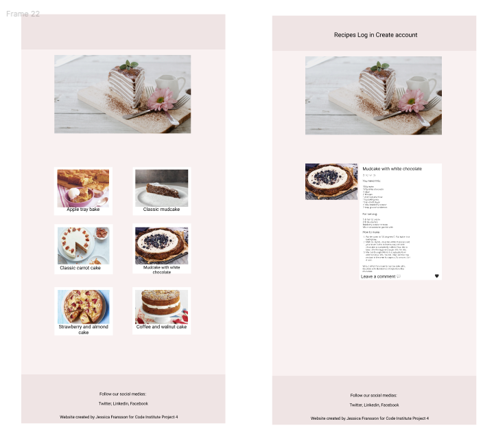

[Back to top ⇧](#bake-me-a-cake)
------

## Features

### Home page

- #### Navigation bar
    - The navbar is always present at the top of the page and houses the links to add recipe, login, logout, create account and home. 
    - The option to add a recipe will only be displayed when a user is logged in
    - The navbar is always a hamburger bar, to make it as easy as possible to focus on the recipes displayed. 

    

------

- #### Hero image
    - The hero image will be displayed on all pages you visit on the website.
    - The hero image contains a text welcomming them to a world of awesome cakes.

     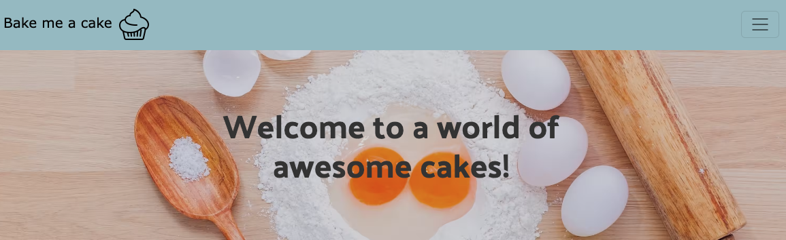
    
------

### Recipe detail 

- #### Displaying recipes
    - The main page displays an image of the recipe along with the author, title of recipe and will display amount of likes.
    - It also displays the date and time the recipe was created

    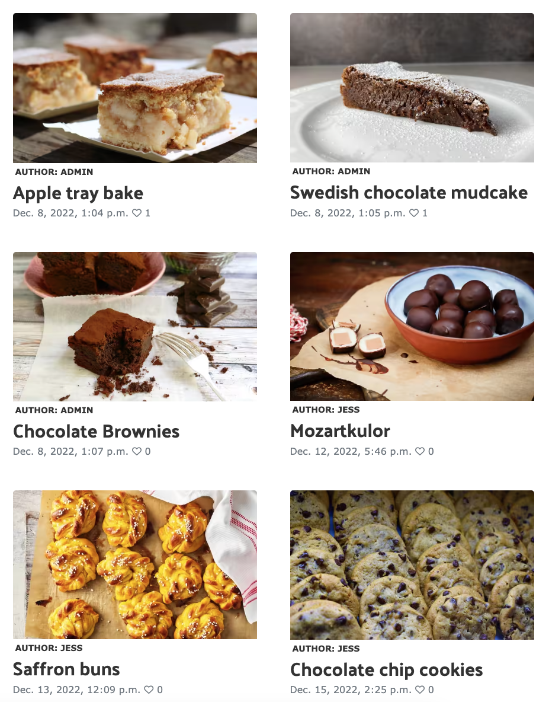

- #### Recipe view
    - When the user clicks a recipe they get to the full recipe page

    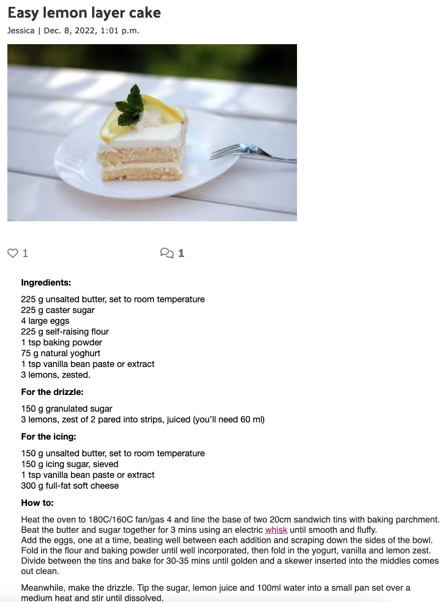

[Back to top ⇧](#bake-me-a-cake)
-------

- #### Interactivity 
    - The user can see the amount of likes and comments at the top of the recipe:

    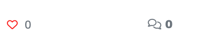

    - The user can also like the post at the top of the recipe, by clicking the heart:

    

    - The user can view and read the feedback left on a recipe: 

    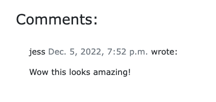

    - The user can leave feedback in the end of the recipe:

    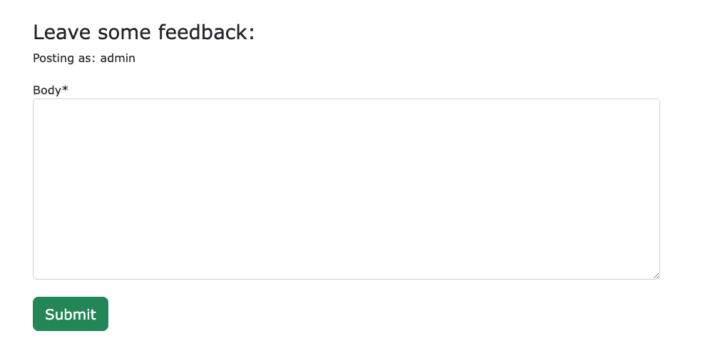

    - The user can add their own recipes:

    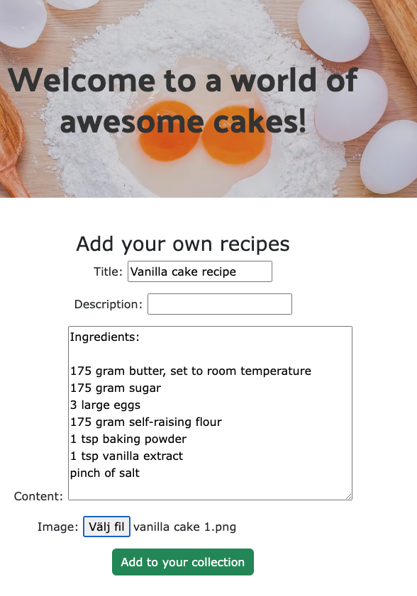

    - The user sees the choise to edit/delete recipes:

    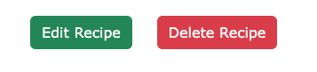

    - The user can edit their own recipes:

    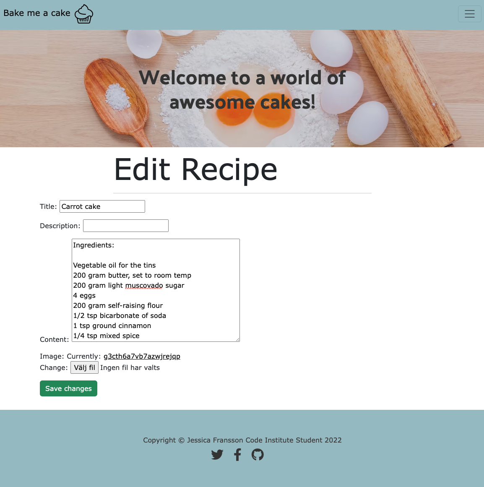

    - The user can delete their own recipes:

    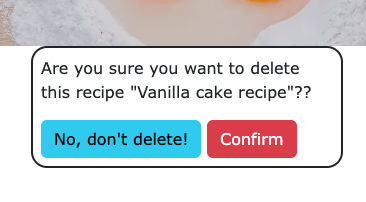

------ 

- #### Pagination
    - In the end of the page the user will see buttons for going to next page, or back up to previous page.

    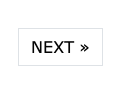
    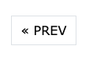

-------

- #### Footer 
    - At the end of each page the user will be displayed with the footer.
    - The footer contains clickable links.
    - The links to Twitter and Facebook links to the general log in page.
    - The link to GitHub directs the user to my GitHub profile for this project.

    

[Back to top ⇧](#bake-me-a-cake)
-------

### Accounts

- #### User Registration
    - The user gets this view when asked to sign up:

    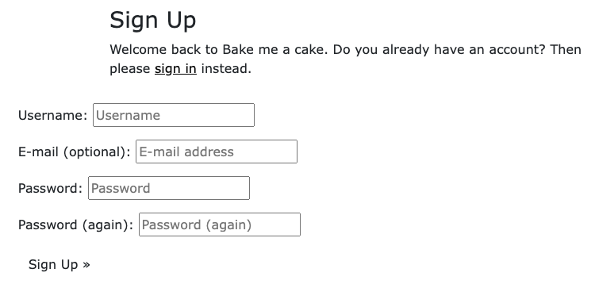

- #### User Login 
    - The User gets this view when logging in:

    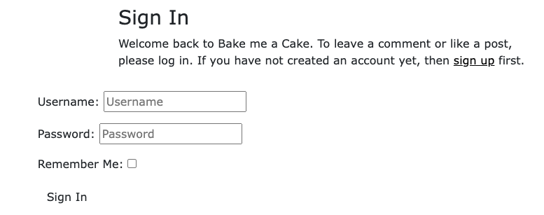

- #### User Logout
    - The user sees this when signing out:

    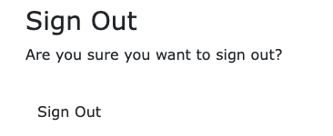

--------

## Features to add

### For the recipe owner 

    - Add the possibility for users to add specified allergies.
    - Add the possibility for users to add ingredients in it's own box.
    - For the user to add a rating system as to how difficult the recipe is.
    - For the user to be able to share the recipe on social media.

### For the visitor

    - For the logged in visitor to add a rating system on each recipes after trying the recipe.

### For the site owner

    - To add a search bar to easy find recipes.
    - To add a users profile page where the user can see their own recipes easily.
    - To add a featured recipe that changes regularly.
    - To add boxes per category, etc one for chocolates, one for candy, one for christmas.

[Back to top ⇧](#bake-me-a-cake)

-------

## Technologies

### Languages used:

- HTML 5
- CSS3
- Python

### Libraries and Programs used: 

- Git, for version control.
- GitHub, for storing code and deploying site.
- Gitpod, Used to build project and editing the code.
- Django, a python based framework to develop this project
- Bootstrap, for HTML design templates.
- Cloudinary, to store images. 
- Figma, to mockup the design.
- ElephantSQL, database through Heroku.
- W3C for validation of HTML and CSS.
- Pep8CI for validation of Python.
- Summernote, for usage in the admin panel.
- Heroku, for deploying the project. 
- Convertion, for converting JPG to AVIF. 

--------

## Testing

Testing and results can be found [here](TESTING.md)

-------

## Create Repository

The project is deployed with Heroku and GitHub.
It is created with GitHub following these steps:

    To create a new repository i followed these steps:

    1. Log in to GitHub.
    2. Click the 'repositories' section.
    3. Pressed the 'new' button, this will create a new repository page.
    4. Choose the CodeInstitute template from the dropdown menu. 
    5. I choose a title for my project and pressed 'create repository'.
    6. Once this is created i opened the repository and pressed the green 'GitPod' button to create my workspace. 

-------

## Deployment

### To deploy this project through Heroku i did following steps:

    1. Log in to [Heroku](https://www.heroku.com/)
    2. From the main Heroku dashboard select 'new', and 'create new app'
    3. Name your project, and select a suitable region. After this press 'create app'. (The name you choose must be unique)
    4. Previous step creates the app in Heroku and will bring you to the deploy tab. From the menu at the top you want to navigate to the resources tab. 
    5. After this you want to add the database to the app, you do this by going to the add-ons section and search for 'Heroku Postgres', select the package that appears and add it to the database. 
    6. Navigat3e to the settings, inside config vars you want to add the DATABASE_URL to the clipboard for the Django config. 
    7. Create a new file in GitPod called env.py and inside set your environment table for the DATABASE_URL and paste in the copied address from Heroku. 
    8. I created a secret key by adding SECRET_KEY in my env.py file, and in heroku. To get the secret key i typed 'openssl rand -base64 16' in my terminal. One time for a secret key to Heroku and a second time for a secret key to add in GitPod. 
    9. Create an account in Cloudinary, or log in if you already have an account. The url is found on your dashboard in your account. Copy this and add to your env.py file. 
    10. Paste it also into your Heroku config vars. 
    11. You now need to add 'KEY - DISABLE_COLLECTSTATIC' with the value of 1 to the config vars in Heroku, this line must be removed before final deployment of the project. 
    12. In GitPod you now have to add the cloudinary libraries to the list of installed apps in the settings file. The order here is important, 'cloudinary_storage' must go above 'django.contrib.staticfiles' and then 'cloudinary' goes below. 
    13. For your settings.py file you must also add the STATIC files, the url, storage path, directory path, root path, media url and the default file storage path. 
    14. You link this to the templates directory in Heroku with 'TEMPLATES_DIR = os.path.join(BASE_DIR, 'templates')'
    15. You also need to add new folders in GitPod. Create media, static and template folders and a file at the top level namned Procfile (the P has to be capital - important!)
    16. Inside the Procfile you need to add following: web: guincorn bakemeacake.wsgi.
    17. After adding these files, commit and push these changes to GitHub.
    18. In Heroku, go to the deployment tab and deploy this branch manually. This will lead to Heroku building this app for you, and you will be able to follow the build process in the window. 
    19. When successful, you will be displayed with following: "Your app was successfully deployed".

[Back to top ⇧](#bake-me-a-cake)

-------

## Credits 

- Code Institute and the code-along project "I think therefor i Blog" which gave me the basic knowledge on creating a basic app, and teaching me how to use an admin panel. 

- Codemy on youtube and the series "Create a blog with Python and Django"

- Camilla Hamid, a swedish baking guru for recipes and style for the blog

- Pixabay for usable images for the recipes

- Font awesome for fonts. 

- Cupcake from Flaticon, and edited in Figma

- Figma for a mockup design. 

--------

## Acknowledgements

There's a few people that has been extra helpful with this project,
    - Del_Alumni for his endless support and troubleshooting, absolute legend! 
    - Ken, Christian, TrevTheDev, among a few of the top legends that's been helping me when i've been stuck. 

- The slack support has been a good place to turn to, the community is always very helpful and good with feedback and ideas and inputs. 

--------

[Back to top ⇧](#bake-me-a-cake)