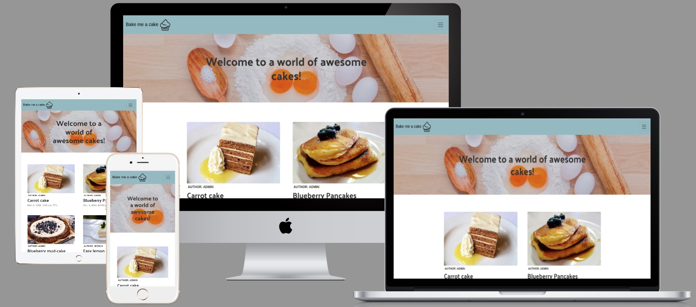

# Bake me a cake

Here's a link to the live project (https://bakemeacake2022.herokuapp.com/)
------
### Bake me a cake is a online recipe-sharing website for people that love baking, and being creative in the kitchen when it comes to cakes or treats.

This project is built using Django Framework in Python.



------

## Content 

- User experience
 * user stories

- Design
 * color and inspiration

- features
 *

- technologies
 * libraries and languages

- testing (#TESTING.md)

- deployment 

- credits 


------
## User experience (UX)

The one visiting bake me a cake is most likely someone who loves to bake, and is looking for new recipes, or who wants to share their favourites and connect with other like minded people. 

------

## User stories

Following is a list of my user stories and it can also be found [here] (https://github.com/jessicafransson/bake-me-a-cake/issues).

### EPIC | Navigation
- As a User I can immediately understand the website's purpose so that I know if it's what I'm looking for.
- As a User I can navigate around the site so that I can easily view the content.
- As a User I can view a list of recipes so that I can choose one to read.
- As a User I can click on a recipe to see the full recipe
- As a User I can click on the recipe to like and leave feedback.

### EPIC | User's Recipes
- As a User I can create recipes so that other users can view them
- As a User I can edit recipes and the image so that I can update any changes or mistakes to my recipes.
- As a User I can delete recipes so that I can remove any unwanted recipes I have made.

### EPIC | User Interaction
- As a User I can like/unlike recipes so that I can mark which recipes I enjoyed.
- As a User I can leave a comment so that I can give my feedback to others.
- As a User I can view the number of likes on each post.
- As a User I can view comments on recipes so that I can read feedback on recipes.

### EPIC | Sign in
- As a User I can register for an account so that I can add my own posts
- As a User i can register for an account so that I can add comments and like posts
- As a user i can log in to like recipes, comment and manage my own posts

### EPIC | Admin
- As an Admin I can view, create, edit and delete all recipes so that I can control the website's content.
- As an admin i can view, create, edit and delete all comments so i can control the content of the recipes.

------

## Design

The look of this project is inspired by Code Institutes "I think therefor I blog" project and swedish pastry Queen Camilla Hamid. Find her live website [here] (https://mykitchenstories.se/)

### Color Scheeme 
- I wanted to keep this website basic and easy to navigate. The color of header and footer is taken from Camilla Hamid, but text is altered to a black-ish color to update the accessibility score. 
- I also want to make sure that the images from the recipes pop-out, as users can add any image. 

### Images
- The images has been taken from pixabay that is currently displayed on the project, future images will be uploaded by various users. 


**I've used Figma to mock-up design, I've used CRUD and used project planning with my to-do list.** 

**Why have you added this script?**
For everyday usage of Gitpod, it doesn’t have any effect at all. The script only captures the following data:

- An ID that is randomly generated each time the workspace is started.
- The current date and time
- The workspace status of “started” or “running”, which is sent every 5 minutes.

It is not possible for us or anyone else to trace the random ID back to an individual, and no personal data is being captured. It will not slow down the workspace or affect your work.


**  **

For security against hackers this is needed in your code 

```
ett annat sätt att makera text
```

```
länk till png cupcake
https://icons8.com/icons/set/cake
```

Images, both for recipe and placeholder url is from pixabay 

```
link to my issues in github and moved to done besides 1, verification email setup
https://github.com/users/jessicafransson/projects/6/views/1
```

## testing

https://pep8ci.herokuapp.com/ all python code has been passed, without errors. 

Color and design inspiration from Swedish baking Queen Camilla Hamid
https://mykitchenstories.se/


