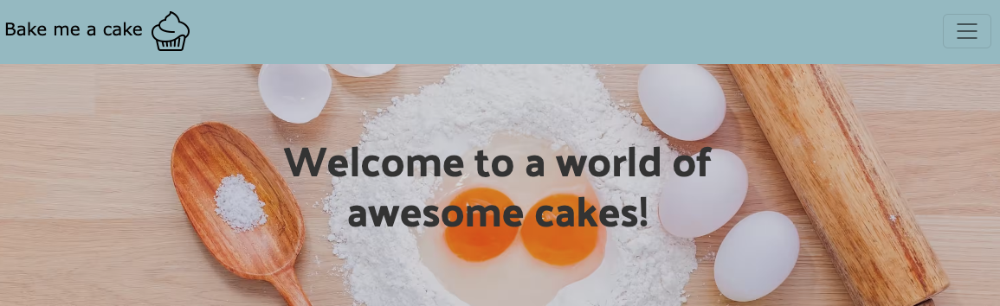
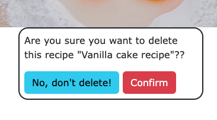

# Bake me a cake! - Testing

## Content

- [Validators] (#validators)
- [User story] (#user-story-testing)
- [Feature testing] (#feature-testing)
- [Bugs] (#bugs)

## Validators
- HTML 
    - No errors found when testing all pages on the official [W3C Validator] (https://validator.w3.org/nu/)
    - All pages passed without errors, only one printscreen because all pages showed the same result.

    

- CSS 
    - No errors when passing thru the official CSS tester. 
    - Official test site [Jigsaw] (https://jigsaw.w3.org/css-validator/)

    

- Python
    - No errors found running python thru CI's own PEP8 test
    - Official test site [Pep8 - CI] (https://pep8ci.herokuapp.com/)

- Lighthouse 
    - Score below, explanations under bugs with score explanation

    

## User story testing 

### EPIC | Navigation

* As a user i can see what the website is all about, and understand its purpose of awesome cakes.
- As soon as the user arrives to the home page they are shown a brief message explaining the sites purpose.

* As a user i can navigate thru the website and see the different options
- There's one view for users that are logged in, displaying the "add recipe button"
and one for users that isn't currently logged in. 

### EPIC | User interaction
* As a user i can view the recipes on a page

* I can also click a recipe to get the full information

* In the recipe i can like and comment on my favourite ones

- As a user i will also be able to see all approved comments underneath the recipe

### EPIC | Sign in

* As a user i can create an account to add my own recipes

* As a user i can log in to my account

* As a user i can also log out from my account

## Feature testing

### As an authorized user you can edit and delete your own recipes
* You press these buttons to go to edit page or delete page

### As an authorized user you can edit your own recipe
* You press the edit button above and get to this page to edit your recipe

### As an authorized user you can delete your own recipes
* You press the delete button and get to this warning before deleting, and an option to go back.

### Only logged in users can create recipes, like posts and leave comments.
* Trying to do so without being logged in gets displayed this message:

### As a logged in user you can only edit and delete your own recipes,
* Trying to do so to someone elses recipe gets displayed this message: 

### As som

## Bugs 

### Fixed

### Unfixed