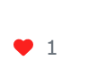
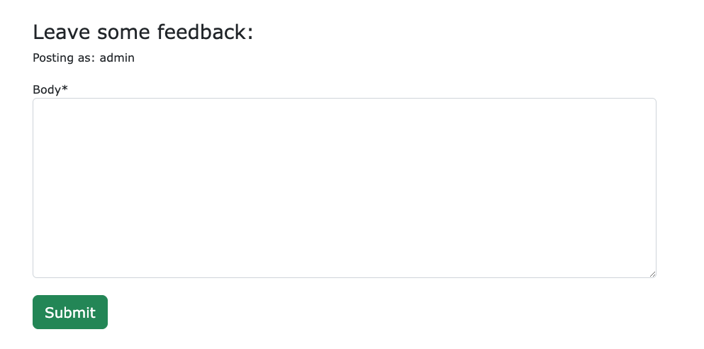
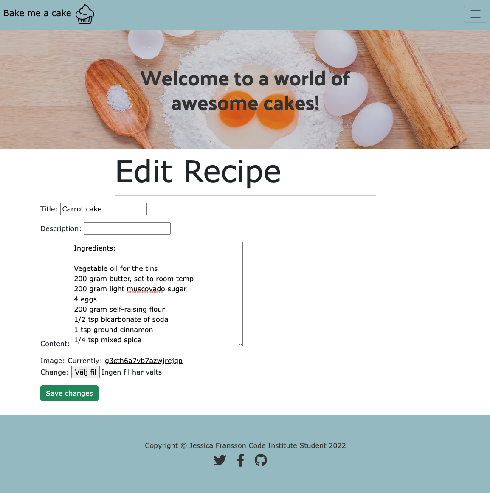
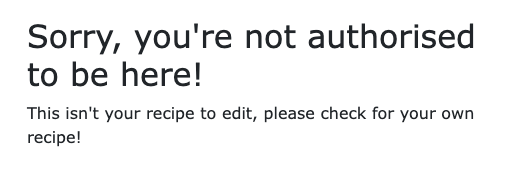

# Bake me a cake! - Testing

## Content

- [Validators] (#validators)
- [User story] (#user-story-testing)
- [Feature testing] (#feature-testing)
- [Bugs] (#bugs)

------

## Validators
- HTML 
    - No errors found when testing all pages on the official [W3C Validator] (https://validator.w3.org/nu/)
    - All pages passed without errors, only one printscreen because all pages showed the same result.

    

- CSS 
    - No errors when passing thru the official CSS tester. 
    - Official test site [Jigsaw] (https://jigsaw.w3.org/css-validator/)

    

- Python
    - No errors found running python thru CI's own PEP8 test
    - Official test site [Pep8 - CI] (https://pep8ci.herokuapp.com/)

- Lighthouse 
    - Score below, explanations under bugs with score explanation:

    

[Back to top ⇧](#bake-me-a-cake)
-----

## User story testing 

### EPIC | Navigation

* As a user i can see what the website is all about, and understand its purpose of awesome cakes.
- As soon as the user arrives to the home page they are shown a brief message explaining the sites purpose.

* As a user i can navigate thru the website and see the different options:
- There's one view for users that are logged in, displaying the "add recipe button"
and one for users that isn't currently logged in. 

------

### EPIC | User interaction
* As a user i can view the recipes on a page:

* I can also click a recipe to get the full information:

* In the recipe i can like and comment on my favourite ones:

- As a user i will also be able to see all approved comments underneath the recipe:

- As a user i can add my own recipes:

[Back to top ⇧](#bake-me-a-cake)
-------

### EPIC | Sign in

* As a user i can create an account to add my own recipes:

* As a user i can log in to my account:

* As a user i can also log out from my account:

------ 

## Feature testing

### As an authorized user you can edit and delete your own recipes
* You press these buttons to go to edit page or delete page:

### As an authorized user you can edit your own recipe
* You press the edit button above and get to this page to edit your recipe:

### As an authorized user you can delete your own recipes
* You press the delete button and get to this warning before deleting, and an option to go back:

### Only logged in users can create recipes, like posts and leave comments.
* Trying to do so without being logged in gets displayed this message:

### As a logged in user you can only edit your own recipes,
* Trying to do so to someone elses recipe gets displayed this message: 

### As a logged in user you can only delete your own recipes,
* Trying to do so to someone elses recipe gets displayed this message: 

[Back to top ⇧](#bake-me-a-cake)
-------

## EPIC | User alerts

### As a user i get feedback from the website when i've successfully added/changed things. 

* I get a message telling me i've successfully logged in / signed up / logged out:

* As a user i get a successmessage when i have added and updated a recipe:

* As a user i get a successmessage when i have added a comment:

-------

## Admin panel

### As the owner of the page i have full control on what recipes gets added and i can approve/edit/delete them.
### I also have full control over comments left and can approve/delete

* I log in to the admin panel and get this view: 

* Here i can view the comments been left on posts,
* Here i also choose to approve or delete the comments:

* I also chose to approve posts:

* Or i choose to delete a post:

[Back to top ⇧](#bake-me-a-cake)
-------

## Bugs 

### Fixed

- I couldn't get my hero image to display on my live site. I fixed this by not linking the image in CSS from a saved image here, and updated it with a link to cloudinary and it worked. 

- My CSS styles didn't follow along after deploying in heroku, image wasn't fixed at the top. 
After going over my code i changed it back to how it was previously before deploying on heroku.

### Unfixed

* I have a score on Lighthouse that i can't change for the better when it comes to two details.

- It's telling me my images don't have explicit width and height on the recipe posts. I've tried to add it both onto my css and inline style without it fixing this issue. 
- Images converted to AVIF after lighthouse errors on https://squoosh.app/ from png to avif

- It's telling me my images are too big, i have exported them to AVIF according to the recommendations and shrunk the size but it's still giving me the error. 
- I found this regarding this error, but i'm still getting the error: 

(https://stackoverflow.com/questions/65076805/image-elements-do-not-have-explicit-width-and-height)

[Back to top ⇧](#bake-me-a-cake)